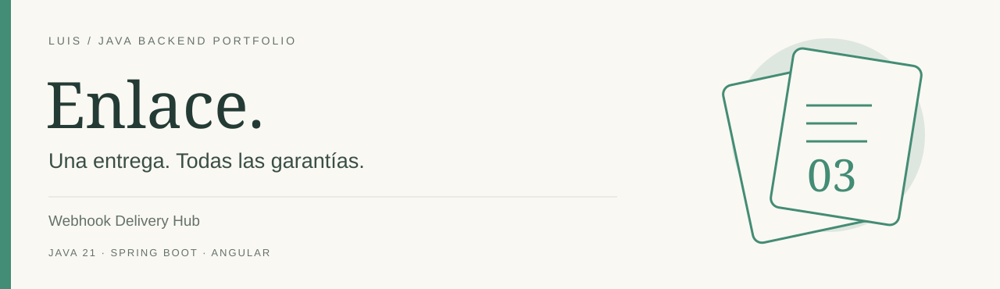
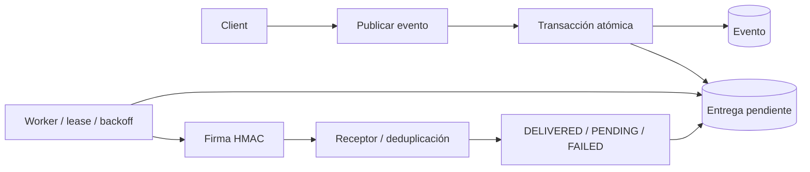

[](https://github.com/LuisDeveloper-Fer/webhook-delivery-hub/actions/workflows/ci.yml)


[](LICENSE)

**Una notificación no debe desaparecer cuando el receptor cae después de confirmar una operación. El evento y su entrega pendiente se guardan en una sola transacción.**

Proyecto independiente del [Backend Systems Lab de Luis](https://github.com/LuisDeveloper-Fer). Código y datos de demostración, sin información propietaria ni dinero real.

## En 60 segundos

- Evento + outbox en una transacción
- Worker con lease, timeout y máximo 5 intentos
- Backoff exponencial con jitter
- HMAC SHA-256 sobre timestamp + body
- Receptor con verificación de firma y deduplicación

**Experimento principal:** Publica un evento normal. Después usa message=simulate-error o simulate-rate-limit. Inspecciona el historial hasta FAILED y ejecuta un replay manual.

## Ejecutar

Requisitos: **JDK 21**, Maven 3.9+, Node 22.12+ para Angular y Docker Compose para el stack completo. [Compatibilidad de Spring Boot](https://docs.spring.io/spring-boot/system-requirements.html) · [Compatibilidad de Angular](https://angular.dev/reference/versions).

```bash
git clone https://github.com/LuisDeveloper-Fer/webhook-delivery-hub.git
cd webhook-delivery-hub
mvn clean package
docker compose up --build
```

| Componente | Dirección |
| --- | --- |
| Angular | http://localhost:4200 |
| API | http://localhost:8080 |

Puertos publicados solo en loopback. Ejecuta un laboratorio a la vez o cambia API_PORT/UI_PORT en el entorno.

### Desarrollo local

```bash
node receiver/server.mjs # en otra terminal
mvn spring-boot:run
# otra terminal:
cd frontend
npm ci
npm start
```

Localmente usa H2 en memoria para arrancar y probar sin dependencias. **Compose usa PostgreSQL 17 con volumen persistente**. Configura DB_URL, DB_USER y DB_PASSWORD para otro datasource. Hibernate ddl-auto=update simplifica el laboratorio; producción requiere migraciones versionadas.

## Arquitectura



La llamada HTTP ocurre fuera de la transacción. Si el proceso muere después de entregar y antes de guardar el resultado, puede reenviar: la semántica es at-least-once. El receptor verifica HMAC y deduplica por eventId. La API no recibe URLs y el cliente no sigue redirecciones, reduciendo la superficie SSRF.

[Decisión técnica](docs/adr/001-design.md) · [Contrato de API](docs/api.md) · [Guion de entrevista](docs/interview.md)

## Primer request

```bash
curl -i -X POST http://localhost:8080/api/events \
+  -H 'Content-Type: application/json' \
+  --data '{"type":"payment.approved","message":"fictional-payment"}'
```

Ejemplo de respuesta, campos relevantes:

```json
{
  "id": "8c7408b5-ff5e-42d1-b078-6172588da913",
  "status": "PENDING",
  "attempts": 0
}
```

IDs y fechas cambian en cada ejecución. [Colección curl](examples/requests.sh) · [Payload JSON](examples/request.json).

## Endpoints

| Método | Ruta | Resultado |
| --- | --- | --- |
| POST | `/api/events` | 202 con Location |
| GET | `/api/deliveries` | Últimas 50 entregas |
| GET | `/api/deliveries/{id}` | Estado e historial |
| POST | `/api/deliveries/{id}/replay` | 200 si FAILED; 409 si activa |

## Pruebas

```bash
mvn clean package
cd frontend && npm ci && npm run build
```

HTTP real, firma HMAC, reintento tras 500, rechazo de replay activo y límites de backoff. Las pruebas no necesitan Docker y usan H2; no sustituyen una validación sobre PostgreSQL. CI compila Java y Angular. [Evidencia y límites de validación](docs/VALIDATION.md).

## Estructura

```text
src/main/java/dev/portfolio/
  api/              Contratos HTTP y validación
  application/      Casos de uso
  domain/           Estado y reglas
  infrastructure/   Clientes o repositorios
src/test/           Pruebas
frontend/           Angular standalone
ops/                Entorno de ejecución
docs/               Decisiones y guía técnica
examples/           Requests reproducibles
```

## Alcance honesto

Worker para una instancia. El receptor deduplica en memoria durante una hora (máximo 10000 IDs); producción requiere deduplicación durable. Replay reinicia el historial del ciclo, no conserva una auditoría ilimitada. Una entrega SENDING abandonada se recupera al expirar su lease de 30 segundos.

API de laboratorio sin autenticación, enlazada localmente. [secure-api-demo](https://github.com/LuisDeveloper-Fer/secure-api-demo) aborda seguridad por separado.

## Para una entrevista

1. Reproduce el experimento principal y explica el resultado.
2. Identifica dónde termina cada transacción y qué garantiza.
3. Explica qué ocurre ante un reinicio o una solicitud duplicada.
4. Justifica qué cambiarías para operar varias instancias.

---

**LuisDeveloper-Fer** · Java Backend Developer · [Los seis laboratorios](https://github.com/LuisDeveloper-Fer) · [MIT](LICENSE)
